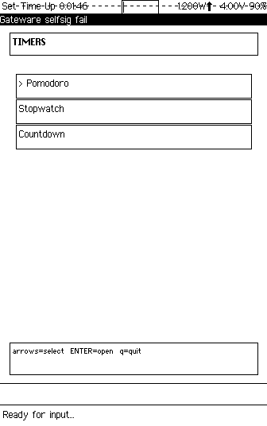
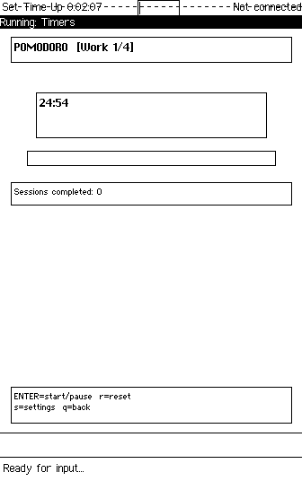
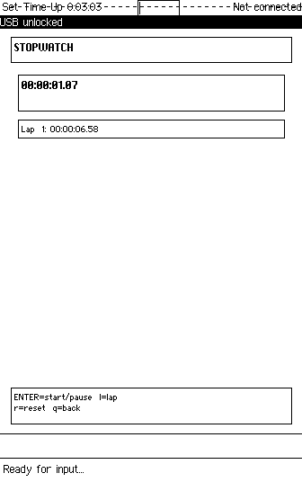
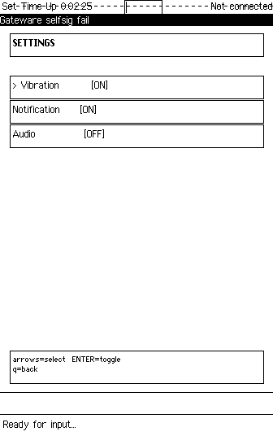

# Timers

**Three relationships with time for the Precursor platform.**

```
A pomodoro timer structures time into work and rest.
A stopwatch measures time as it passes.
A countdown timer makes time visible as it disappears.

Three modes. Three relationships. One device that respects your attention.
```

---

## What This Is

Timers is a unified timer suite for [Precursor](https://www.crowdsupply.com/sutajio-kosagi/precursor) — bunnie Huang's open-source, auditable secure computing handheld running the Xous microkernel OS. It offers three modes: a Pomodoro Timer for structured work sessions, a Stopwatch for capturing moments with centisecond precision, and a Countdown Collection for named timers you create and persist.

Each mode embodies a different relationship with time. The Pomodoro timer is a contract with yourself — you agree to work, then rest, then work again. The stopwatch is observation without judgment — time passes, you record it. The countdown timer is anticipation made concrete — you watch time disappear, and when it reaches zero, you know. No ambiguity. No distraction. Just you and the thing you're measuring.

---

## Why This Project

Time management tools belong on a distraction-free device.

Every phone timer competes with notifications, social media tabs, and the gravitational pull of infinite scroll. You set a 25-minute Pomodoro and three minutes later you're checking messages. The timer is still running. You are not.

Precursor has no notifications from other apps. No browser. No social media. When you start a work session, the device holds you accountable because there is nothing else to do on it. The physical keyboard means your fingers learn the controls — Enter to start, `r` to reset, `q` to return — until the interaction becomes muscle memory and disappears.

This is not a limitation. This is the point.

---

## Why Precursor

Precursor's constraints shaped every design decision in this app.

**Battery awareness**: Timers must survive sleep. The pump thread stops sending messages when the app loses focus, and resumes cleanly when it regains foreground. No CPU wasted counting seconds no one is watching.

**Centisecond precision**: The stopwatch displays hundredths of a second. A dedicated pump thread sends `Pump` messages at 100ms intervals using the Xous ticktimer, providing consistent timing without busy-waiting. The thread sends blocking scalars, creating natural backpressure — if the main loop is still drawing, the pump waits.

**PDDB persistence**: Your Pomodoro durations, alert preferences, and named countdown timers survive app restarts. They live in Precursor's hardware-encrypted flash storage. Your time management configuration is private by default.

**Physical keyboard**: No touch targets to miss. No gestures to remember. Function keys for universal actions (F1 help, F2 start/stop, F3 reset, F4 exit), letter keys for mode-specific commands. After a week of use, you stop thinking about which key to press. Your hands know.

---

## How It Works

### Universal Keys

| Key | Action |
|-----|--------|
| F1 | Menu / Help |
| F2 | Start/Stop (in timer modes) |
| F3 | Reset (in timer modes) |
| F4 | Exit / Back |

### Pomodoro Timer

A contract with yourself. You agree to work for 25 minutes, then rest for 5, then work again. After four cycles, a longer break. The timer auto-transitions between phases, tracks completed sessions, and alerts you at each boundary.

- **25-minute work sessions** (default, configurable)
- **5-minute short breaks** between sessions (configurable)
- **15-minute long break** after 4 cycles (configurable)
- **Configure via Settings** — adjust all durations and cycle count
- Auto-transitions between work and break phases
- Progress bar showing time elapsed in current phase
- Session counter tracking completed work sessions
- Vibration and notification alerts on phase transitions
- Settings persisted to PDDB

**Controls:**

| Key | Action |
|-----|--------|
| Enter | Start / Pause |
| r | Reset current phase |
| s | Open settings |
| q | Back to mode select |

### Stopwatch

Observation without judgment. Time passes. You record it.

- **HH:MM:SS.cs** format (centisecond precision)
- Display updates every 100ms while running
- Record up to 99 laps (most recent shown first)
- **Scrollable lap list** — use Up/Down arrows to scroll through lap history
- Lap times show individual split durations

**Controls:**

| Key | Action |
|-----|--------|
| Enter | Start / Pause |
| l | Record lap (while running) |
| Up/Down | Scroll through laps |
| r | Reset (while stopped) |
| q | Back to mode select |

### Countdown Collection

Anticipation made concrete. You name a timer, set a duration, and watch time disappear.

- Store up to 20 named timers
- Enter duration in MM:SS format
- Progress bar during countdown
- Vibration and notification on expiry
- Persisted to PDDB (survives app restart)

**Controls (list):**

| Key | Action |
|-----|--------|
| Enter | Start selected timer |
| n | Create new timer |
| d | Delete selected timer |
| Up/Down | Navigate list |
| q | Back to mode select |

**Controls (running):**

| Key | Action |
|-----|--------|
| Enter | Pause / Resume |
| r | Reset to original duration |
| q | Back to timer list |

### Settings

Configure alert behavior for timer expirations.

| Setting | Default | Description |
|---------|---------|-------------|
| Vibration | ON | Device vibration on timer events |
| Notification | ON | Modal notification popup |
| Audio | OFF | Audio tone (not implemented) |
| Configure Pomodoro | -- | Edit work/break durations and cycles |

---

## Screenshots

*Captured via headless Renode emulation on macOS ARM64. The Precursor display is 336x536 pixels, 1-bit monochrome.*

### Three Modes, Three Relationships with Time

The mode select screen. Each option leads to a different way of attending to time — structured, observed, or anticipated.



### Work Session in Progress

The Pomodoro timer holds you accountable. A progress bar fills as the session advances. The session counter tracks how many cycles you've completed. When the phase ends, the device vibrates — you don't need to watch the screen.



### Lap Times Capture Moments as They Pass

The stopwatch records time with centisecond precision. Lap splits accumulate as you press `l`. Scroll through the history with arrow keys. The time doesn't care whether you're watching.



### Configurable Work and Break Cycles

The settings screen lets you shape the Pomodoro contract — how long you work, how long you rest, how many cycles before the long break. Your preferences persist in PDDB across restarts.



---

## Technical Architecture

```
timer-core/             Pure timing logic (no Xous deps, host-testable)
src/
  main.rs               Event loop, state machine, pump thread
  pomodoro.rs           Pomodoro state (work/break cycles)
  stopwatch.rs          Stopwatch state (laps)
  countdown.rs          Named countdown timers
  storage.rs            PDDB persistence
  alerts.rs             Vibration/notification alerts
  ui.rs                 Drawing functions per screen
```

### timer-core Library

The `timer-core` crate provides platform-independent timing logic, testable on the host:

- `TimerCore` struct: start/pause/reset/lap with millisecond precision
- Count-up mode (stopwatch) and count-down mode (countdown/pomodoro)
- Time formatting: `format_hms`, `format_hms_cs`, `format_ms`
- Binary serialization helpers for PDDB storage

Run tests: `cargo test -p timer-core`

### Pump Thread

A dedicated background thread sends periodic `Pump` messages to the main event loop:

- **100ms** interval for stopwatch (centisecond display)
- **1000ms** interval for pomodoro/countdown (second display)
- Automatically stopped when app loses focus or timers are paused
- Zero CPU usage when no timer is actively running

### PDDB Storage Layout

All persistent data stored in the `timers` dictionary:

| Key | Format | Content |
|-----|--------|---------|
| `pomodoro_settings` | 25 bytes | work_ms + short_ms + long_ms + cycles |
| `alert_config` | 3 bytes | vibration + audio + notification flags |
| `countdowns` | variable | count + [name_len + name + duration_ms]... |

---

## Design Decisions

**Chat UX** (`UxType::Chat`): Text-oriented UI with managed drawing. Each mode renders its state using `TextView` and drawing primitives within a content canvas. No framebuffer pixel manipulation needed — the GAM handles compositing.

**Pump thread pattern**: Copied from the ball app — the canonical Xous animation pattern. A background thread sends blocking scalar messages at fixed intervals. Blocking sends provide natural backpressure: if the main loop is busy drawing, the pump thread waits rather than flooding the message queue.

**timer-core separation**: All timing logic lives in a standalone crate with no Xous dependencies. This means `cargo test -p timer-core` runs on the host machine in milliseconds. The Xous app is a thin shell around the core library — it handles input, drawing, and PDDB, but never calculates elapsed time directly.

**State machine**: The main loop is a flat state machine (`ModeSelect`, `Pomodoro`, `Stopwatch`, `CountdownList`, `CountdownRunning`, `Settings`, `PomodoroSettings`). State transitions are explicit. There is no hidden state. Each mode knows exactly what keys it handles and what to draw.

**Adaptive pump intervals**: The stopwatch needs 100ms updates for centisecond display. The Pomodoro timer needs only 1000ms updates. Rather than running at 100ms always (wasting 90% of pump messages in Pomodoro mode), the pump interval adapts to the active mode. On the 100 MHz Precursor CPU, this matters.

---

## Building

Timers is a Xous app. It builds as part of the [xous-core](https://github.com/betrusted-io/xous-core) workspace.

### Integration

1. Clone into the apps directory:

   ```bash
   cd xous-core/apps
   git clone https://github.com/tbcolby/precursor-timers.git timers
   ```

2. Add to workspace `Cargo.toml` (both `members` and `default-members`):

   ```toml
   "apps/timers",
   "apps/timers/timer-core",
   ```

3. Add to `apps/manifest.json`:

   ```json
   "timers": {
       "context_name": "Timers",
       "menu_name": {
           "appmenu.timers": {
               "en": "Timers",
               "en-tts": "Timers"
           }
       }
   }
   ```

4. Build for Renode emulator:

   ```bash
   cargo xtask renode-image timers
   ```

5. Build for hardware:

   ```bash
   cargo xtask app-image timers
   ```

### Testing

```bash
# Run timer-core unit tests on host
cargo test -p timer-core

# Build for Renode emulation
cargo xtask renode-image timers
```

---

## Changelog

### v0.2.0

- **Pomodoro configuration** — configure work/break durations and cycle count via Settings
- **Lap scroll** — use Up/Down arrows to scroll through stopwatch lap history
- **Fixed F4 quit** — F4 at mode select now properly exits the app
- **Pomodoro settings persistence** — custom durations saved to PDDB

### v0.1.0

- Initial release with Pomodoro, Stopwatch, and Countdown modes

---

## Development
---

This app was developed using the methodology described in [xous-dev-toolkit](https://github.com/tbcolby/xous-dev-toolkit) — an LLM-assisted approach to Precursor app development on macOS ARM64.

## Author
---

Made by Tyler Colby — [Colby's Data Movers, LLC](https://colbysdatamovers.com)

Contact: [tyler@colbysdatamovers.com](mailto:tyler@colbysdatamovers.com) | [GitHub Issues](https://github.com/tbcolby/precursor-timers/issues)

## License
---

Licensed under the Apache License, Version 2.0.

See [LICENSE](LICENSE) for the full text.
